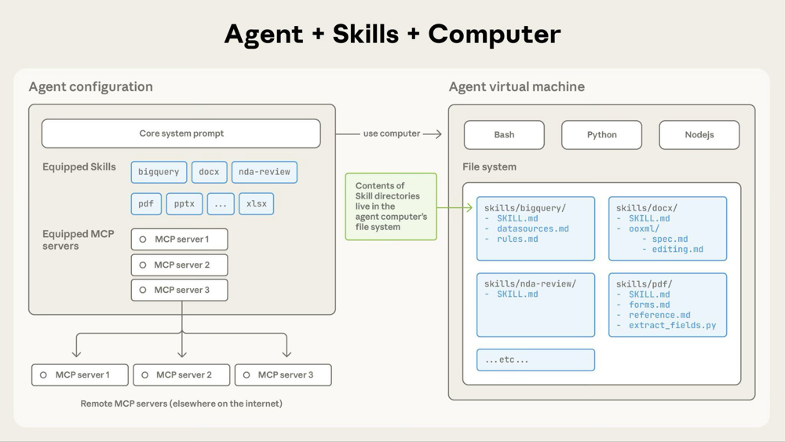
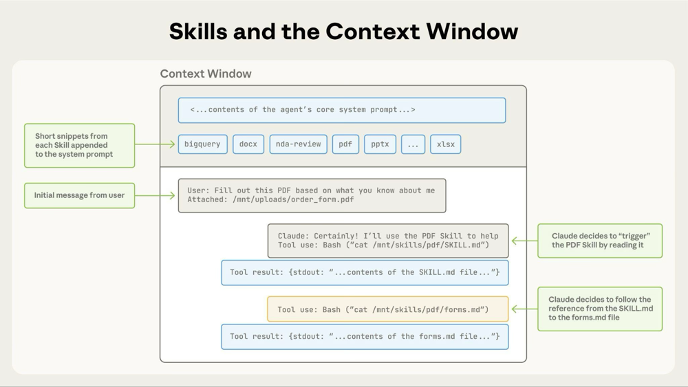

# Skills and Agents Rules

These rules and context regarding the Claude Skills.

## **Why Agent Skills?**

Agents are increasingly capable, but often don’t have the context they need to do real work reliably. Skills solve this by packaging procedural knowledge and company-, team-, and user-specific context into portable, version-controlled folders that agents load on demand. This gives agents:

- **Domain expertise**: Capture specialized knowledge — from legal review processes to data analysis pipelines to presentation formatting — as reusable instructions and resources.
- **Repeatable workflows**: Turn multi-step tasks into consistent, auditable procedures.
- **Cross-product reuse**: Build a skill once and use it across any skills-compatible agent.

## **How do Agent Skills work?**

Agents load skills through **progressive disclosure**, in three stages:

1. **Discovery**: At startup, agents load only the name and description of each available skill, just enough to know when it might be relevant.
2. **Activation**: When a task matches a skill’s description, the agent reads the full `SKILL.md` instructions into context.
3. **Execution**: The agent follows the instructions, optionally executing bundled code or loading referenced files as needed.

Full instructions load only when a task calls for them, so agents can keep many skills on hand with only a small context footprint.

Rules:

1. Always write back the learned rules during the converations. put the **learned rules** inside rules folder in .**claude** folder. this way we can learn from mistakes and build more stable agents and skills.
2. Always write back the context that is been given to you by the developer. this way we can leverage overtime context complition and avoid incomplete context. put it under the **Learned Context** section.
3. Devide the CLAUDE.md, GEMINI.md or CODEX.md into multiple files and reference those files inside the root markdown file so the Agent would load target reference if needed. this way our token useage would be reduced. for instance we can devide the root markdown file into context, rules, etc...
4. Skills are the evolution of SOPs (standard operation procedure). Just like checklists and SOPs are for people, Skills are for agents. if you have a SOP, you have a Skill. Skill fix themselves overtime.
5. Memory is very important in AI. it is transportable and every project must have a memory.
6. Avoid long chat session. Always compact and move to another session to prevent Higher token useage
7. Also put conext and memory to prevent higher token useage
8. Always put instruction to update the memory and context and rule so the AI sould update these files and prevent fact slips.
9. Model Stacking. do not use most expencive models for easy tasks. choose wisely.
10. Always plan before coding. change the mode to plan and then plan and brainstorm after that you would have a nice and complete plan to give it to AI and start coding based on that plan.
11. Test the created Skill using all modes. start from smallest models and if the skill did it's work perfectly then it would be enough, otherwise you must add more context or rule to be able to make the skill perform the action on smaller models. Smaller models are the basic evaluation for skills not the Flagship models.
12. Tool Spliting: Use every tool for it's purpose. Claude Code, Claude Cowork, Claude Design, Claude Chat.
13. Use other providers too. use Grok for news, Use GPT for brainstorming, use Gemini for search and deep searches. Do not use Claude for everything.
14. Always tell the AI to ask question and not speculate about the situation. Do not invent new thing, ask me if you have doubts.
15. We can use WisprFlow to dictate and it will write it for us perfectly. (optional tool)
16. Agent team is a feature that sub agents are able to talk to each other and communicate. this feature is experimental and need to be enabled specifically. this feature consumes a lot of tokens and it must be used with caution. We must use git worktrees to be able to work with agent teams, otherwise the agents will encounter conflict.
17. Always compact and switch to another session with the compact prompt and start a new one. this way will use less tokens.
18. Install and use rtk for reduce token use on bash commands and check saving by using `rtk gain` command. `https://github.com/rtk-ai/rtk`
19. Always install and enable caveman to reduce token usage.

#### Claude Code skills folder structure.

```shellscript
.claude/skills/<skill-name>/
├── SKILL.md           # Instructions (required)
├── TEMPLATE.md        # Optional template
├── FORMS.md           # supplemental guidance (loaded if referenced)
├── REFERENCE.md       # detailed APIs or examples 
├── assets/           # Optional: templates, resources
├── references/        # Optional: docs or sample data
│   └── guide.md
└── scripts/
    ├── fill_form.py   # deterministic Python script
    ├── utility.py
    └── helper.sh
```

#### SKILL.md Format. **frontmatter** section.

```yaml
---
name: my-skill               # Optional. Defaults to directory name. Lowercase/numbers/hyphens, max 64 chars.
description: What it does    # Recommended. Claude uses this to decide when to auto-load. maximum 1024
argument-hint: [issue-num]   # Optional. Shown in autocomplete.
disable-model-invocation: true  # Optional. Prevents Claude from auto-invoking. Default: false.
user-invocable: false        # Optional. Hides from / menu. Default: true.
allowed-tools: Read, Grep    # Optional. Tools allowed without permission prompts when skill is active.
model: claude-opus-4-6       # Optional. Model override when skill is active.
context: fork                # Optional. Runs in isolated subagent context.
agent: Explore               # Optional. Subagent type when context: fork. Default: general-purpose.
hooks: ...                   # Optional. Lifecycle hooks scoped to this skill.
---
```

### **Frontmatter**

| **Field**       | **Required** | **Constraints**                                                                                                   |
| --------------- | ------------ | ----------------------------------------------------------------------------------------------------------------- |
| `name`          | Yes          | Max 64 characters. Lowercase letters, numbers, and hyphens only. Must not start or end with a hyphen.             |
| `description`   | Yes          | Max 1024 characters. Non-empty. Describes what the skill does and when to use it.                                 |
| `license`       | No           | License name or reference to a bundled license file.                                                              |
| `compatibility` | No           | Max 500 characters. Indicates environment requirements (intended product, system packages, network access, etc.). |
| `metadata`      | No           | Arbitrary key-value mapping for additional metadata.                                                              |
| `allowed-tools` | No           | Space-separated string of pre-approved tools the skill may use. (Experimental)                                    |

## **File references**

When referencing other files in your skill, use relative paths from the skill root:

**SKILL.md**

```text
See [the reference guide](references/REFERENCE.md) for details.

Run the extraction script:
scripts/extract.py
```

Keep file references one level deep from `SKILL.md`. Avoid deeply nested reference chains.

### Agents + Skills + Computer



### Skills and Context Window:



### Built-in Skills:  pptx, xlsx , docx , pdf, etc...

#### Built-in Agents: Bash, Glob, Grep, Read, Write, Edit, etc...

### ChatGPT Deep Search Result:

Executive Summary.pdf

### Managing Knowledge base: Obsidian + Claude

### Open Source Skills and Agents

<https://github.com/agentskills/agentskills>

<https://github.com/anthropics/skills>

<https://github.com/garrytan/gstack>

<https://github.com/nextlevelbuilder/ui-ux-pro-max-skill>

<https://github.com/affaan-m/everything-claude-code>

<https://github.com/thedotmack/claude-mem>

<https://github.com/obra/superpowers>

<https://github.com/JuliusBrussee/caveman>

<https://github.com/rtk-ai/rtk>
